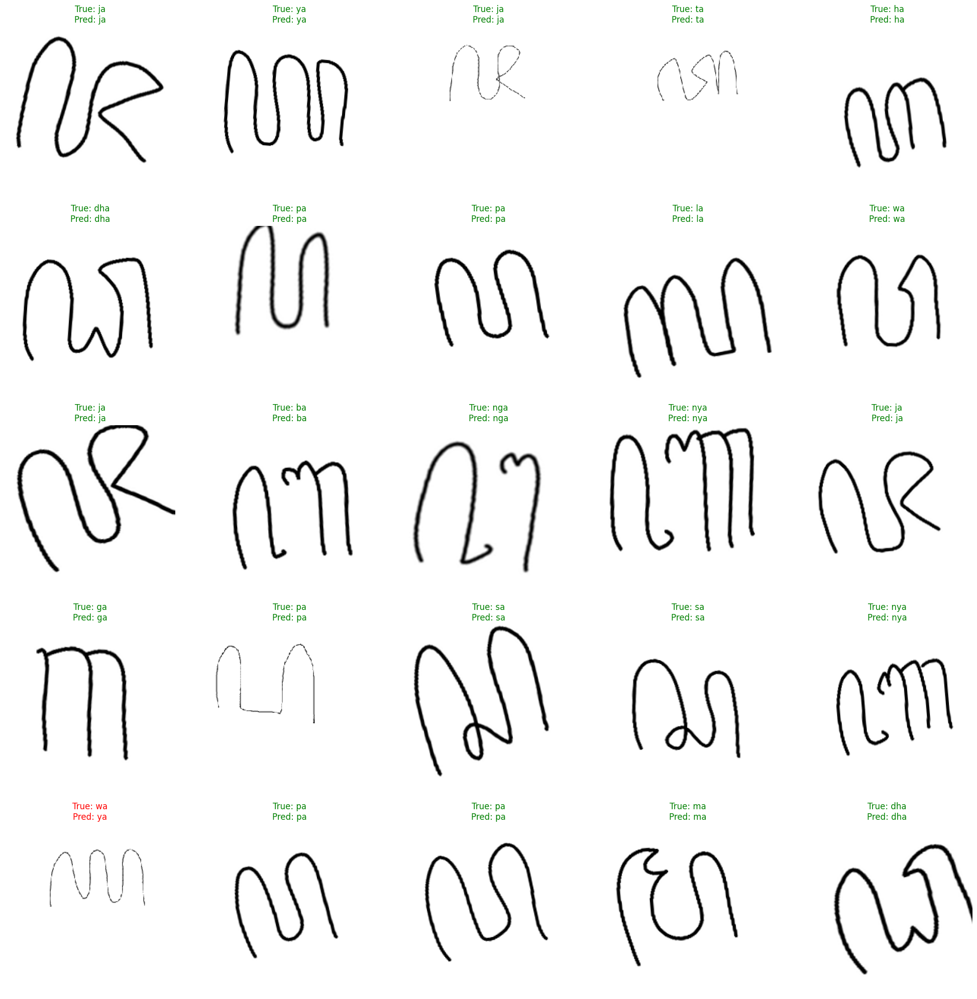

# Hanacaraka Aksara Jawa Handwriting Detection

A deep learning project for recognizing handwritten Javanese script (Aksara Jawa/Hanacaraka) characters using a fine-tuned ResNet50V2 model.

## Overview

This project implements a convolutional neural network to classify 20 different Javanese script characters. The model uses transfer learning with ResNet50V2 as the base architecture and achieves high accuracy (>96%) through data augmentation and fine-tuning techniques.

## Dataset

The training data comes from two Kaggle datasets:
- [Javanese Script Aksara Jawa Augmented](https://www.kaggle.com/datasets/hannanhunafa/javanese-script-aksara-jawa-augmented)
- [Hanacaraka](https://www.kaggle.com/datasets/vzrenggamani/hanacaraka)

The dataset contains images of 20 different Javanese characters with the following split:
- **Training**: 70%
- **Validation**: 15%
- **Testing**: 15%

## Model Architecture

- **Base Model**: ResNet50V2 (pre-trained on ImageNet)
- **Input Shape**: 224 × 224 × 3
- **Architecture**:
  - ResNet50V2
  - Global Average Pooling
  - Dense layer (256 units, ReLU activation, L2 regularization)
  - Dropout (0.5)
  - Output layer (20 units, Softmax activation)

## Training Strategy

### Phase 1: Feature Extraction
- Freeze ResNet50V2 base layers
- Train only the classifier head
- Learning rate: 1e-4

### Phase 2: Fine-tuning
- Unfreeze last 40 layers of ResNet50V2
- Fine-tune with lower learning rate: 1e-5
- Data augmentation applied during training

### Data Augmentation
- Rotation: ±20 degrees
- Zoom: 0.9-1.0
- Width/Height shift: ±20%
- Shear: ±20%
- ResNet50V2 preprocessing

### Callbacks
- **Early Stopping**: Monitor validation loss, patience=5
- **Learning Rate Reduction**: Factor=0.2, patience=3

## Requirements

```python
# Core dependencies
tensorflow>=2.x
opencv-python==4.11.0.86
pandas>=2.3.2
numpy
matplotlib
seaborn>=0.13.2
scikit-learn>=1.7.2

# For Streamlit app
streamlit>=1.50.0
pillow

# Development tools
git-filter-repo>=2.47.0
```

## Installation

1. Clone the repository:
```bash
git clone https://github.com/Exilitys/Hanacaraka-Aksara-Jawa-Handwriting-Detection.git
cd Hanacaraka-Aksara-Jawa-Handwriting-Detection
```

2. Install dependencies:
```bash
pip install -r requirements.txt
```

3. Set up the dataset:
   - Download the datasets from Kaggle
   - Place the data in `./hanacaraka/` directory

## Model Evaluation

The notebook includes comprehensive evaluation:
- **Accuracy metrics**
- **Classification reports**
- **Confusion matrix visualization**
- **ROC curves for all classes**
- **Sample predictions with true vs predicted labels**

## Saved Models

The trained model is saved as:
- `ResNet50-FineTune-40Fl.keras` - Final model (https://drive.google.com/drive/folders/1bdIbwjfyi5Spclair9FxbQG3GU5toH93?usp=sharing)
- `class-indicies.pkl` - Class label mappings

## Results

The model demonstrates strong performance on the test set with detailed classification reports and visualizations available in the notebook.



### Key Features:
- Multi-class classification of 20 Javanese characters
- Transfer learning with ResNet50V2
- Comprehensive data augmentation
- Fine-tuning strategy for improved performance
- Detailed evaluation metrics and visualizations

## File Structure

```
├── aksara-jawa-letter-classification (1).ipynb  # Main training notebook
├── hanacaraka/                                  # Dataset directory
├── ResNet50-FineTune-40Fl.keras               # Trained model
├── class-indicies.pkl                          # Class mappings
├── .python-version                             # Python version
├── pyproject.toml                              # Project configuration
├── uv.lock                                     # Dependency lock file
└── README.md                                   # This file
```

## Contributing

1. Fork the repository
2. Create a feature branch (`git checkout -b feature/amazing-feature`)
3. Commit your changes (`git commit -m 'Add some amazing feature'`)
4. Push to the branch (`git push origin feature/amazing-feature`)
5. Open a Pull Request

## License

This project is licensed under the MIT License - see the [LICENSE](LICENSE) file for details.

## Acknowledgments

- Kaggle dataset contributors
- TensorFlow/Keras community
- ResNet50V2 architecture by Microsoft Research


**Note**: This project focuses on individual character recognition. For complete text recognition, additional preprocessing for character segmentation would be needed.
